# Mermaid Diagram Templates

Mermaid diagram patterns for all diagram types needed in arc42 documentation. Each template includes a blank version, an annotated version with guidance, and a filled example.

---

## Business Context Diagram (Section 3.1)

Shows the system as a central node with external actors and systems.

### Blank Template

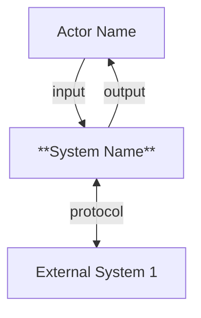

### Annotated Template

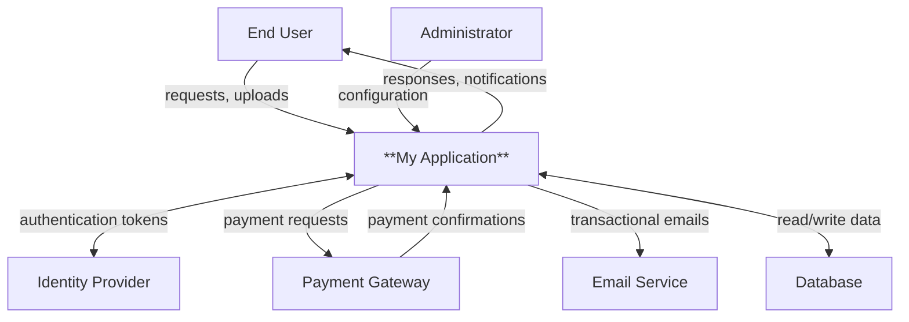

### Filled Example (E-Commerce)

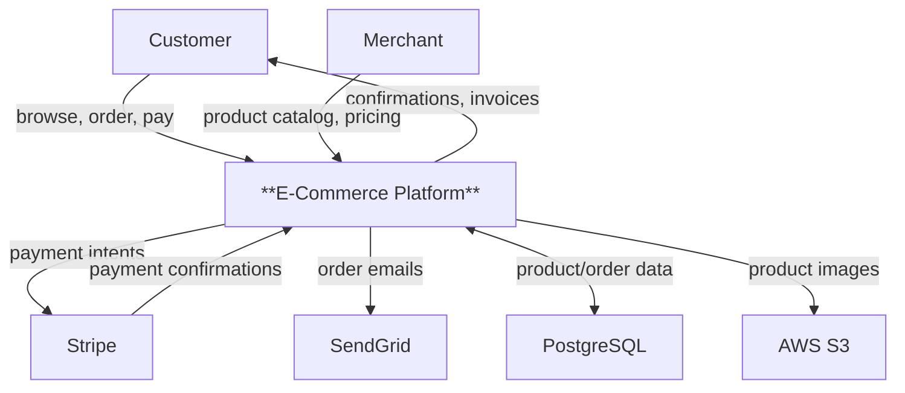

---

## Technical Context Diagram (Section 3.2)

Shows protocols, channels, and infrastructure elements.

### Blank Template

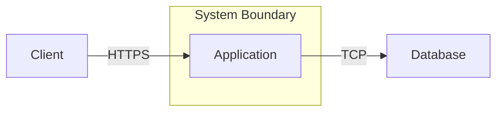

### Filled Example

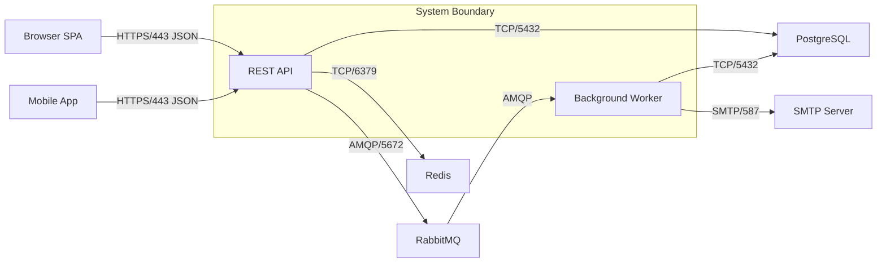

---

## Building Block View Level 1 (Section 5.1)

Top-level decomposition of the system.

### Blank Template

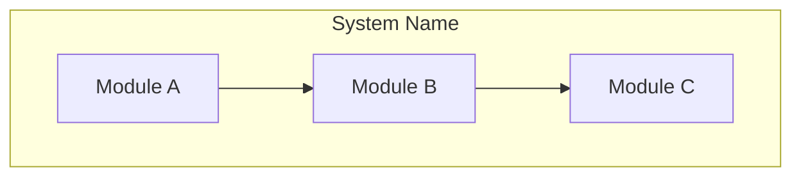

### Filled Example (Web Application)

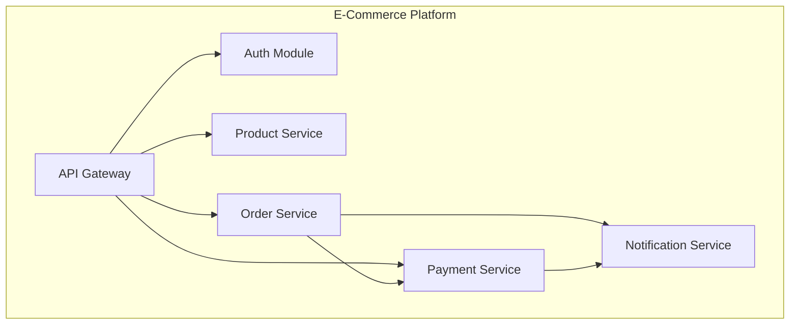

---

## Building Block View Level 2+ (Section 5.2+)

Decompose a Level 1 block into its internal components.

### Blank Template

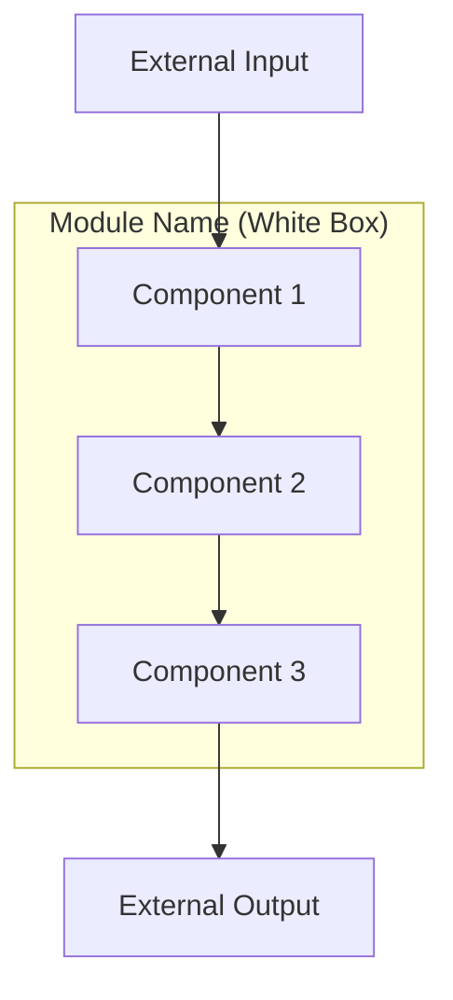

### Filled Example (Order Service)

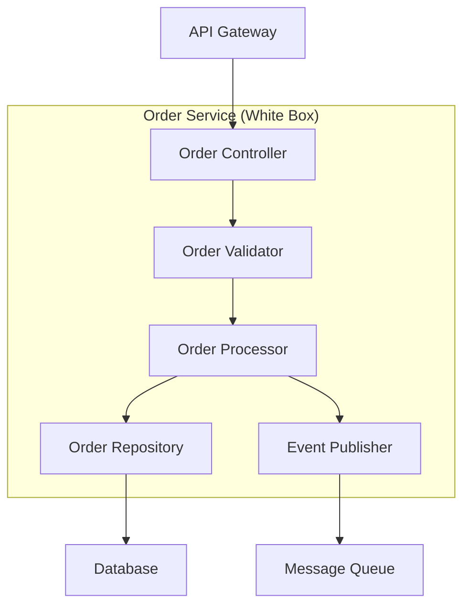

---

## Runtime Sequence Diagram (Section 6)

Show building blocks interacting for a specific scenario.

### Blank Template

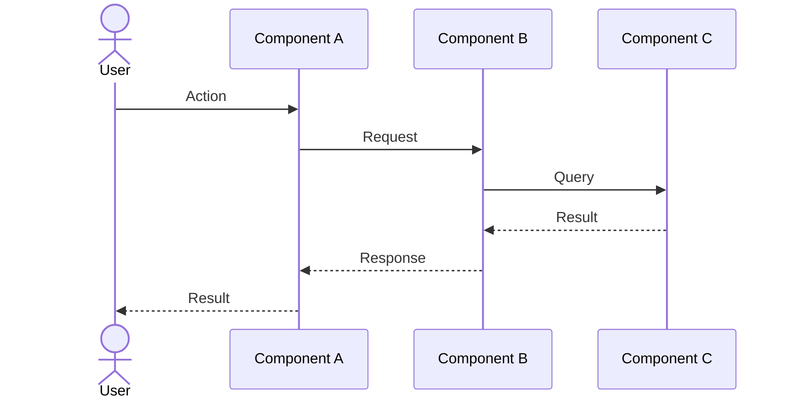

### Filled Example (Place Order)

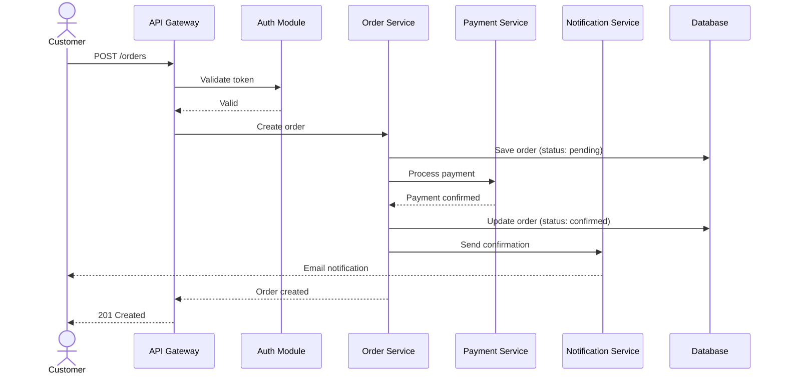

### Error Scenario Example

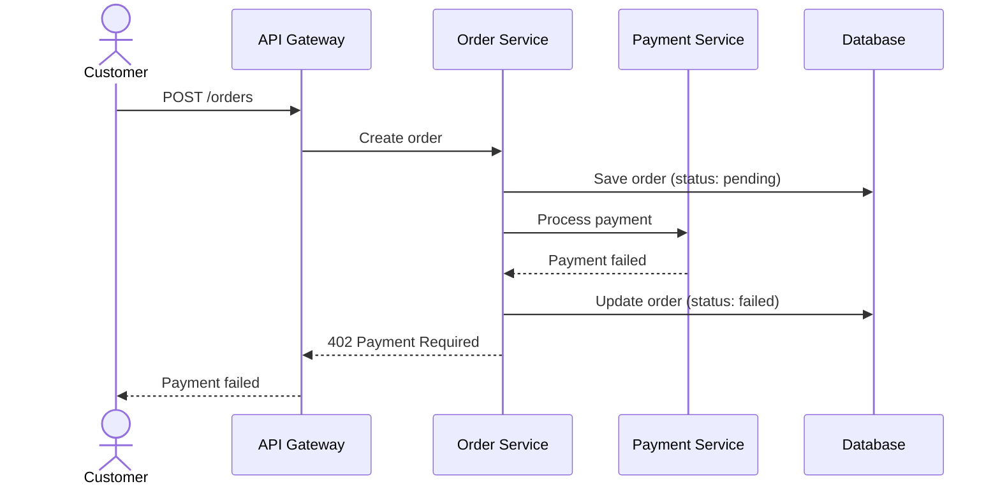

---

## Deployment Diagram (Section 7)

Show infrastructure elements and building block mapping.

### Blank Template

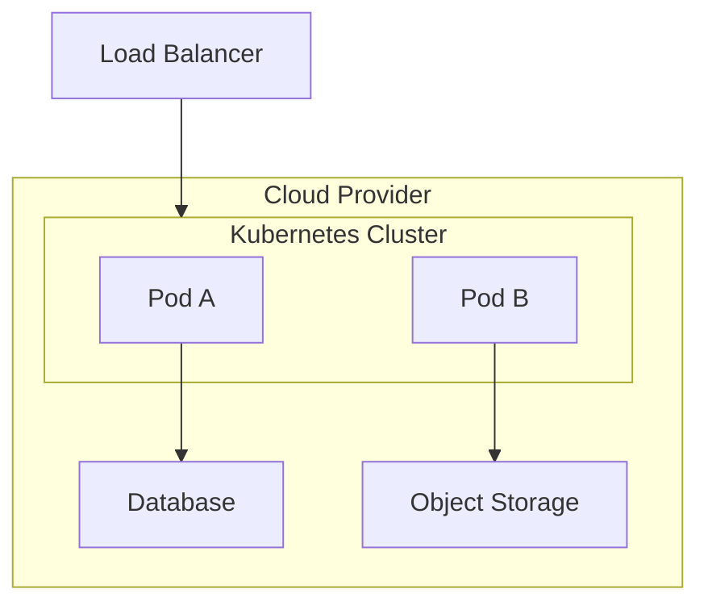

### Filled Example

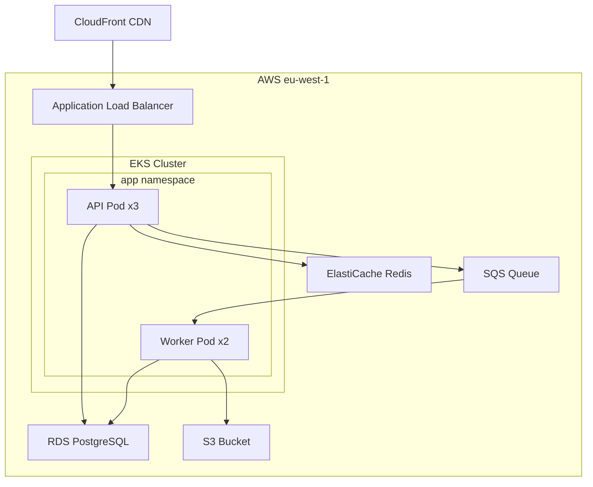

---

## Quality Tree (Section 10.1)

Mind-map showing quality attribute refinement.

### Blank Template

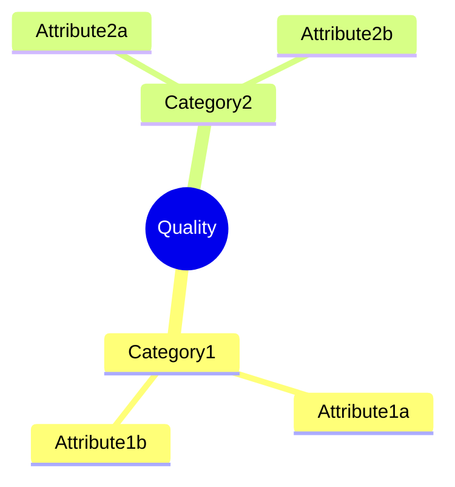

### Filled Example

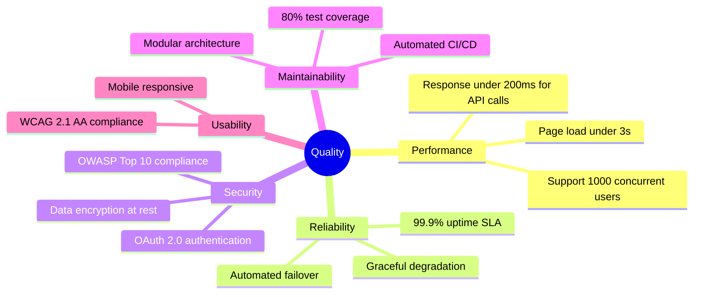

---

## C4 Model Integration

Arc42 sections map naturally to C4 views. Use these mappings when the project follows C4 conventions:

| C4 Level | Arc42 Section | Diagram Type |
|----------|--------------|-------------|
| **Context** (Level 1) | Section 3 -- Context and Scope | Business/Technical context diagrams |
| **Container** (Level 2) | Section 5.1 -- Building Block View Level 1 | System decomposition into deployable units |
| **Component** (Level 3) | Section 5.2 -- Building Block View Level 2 | Internal structure of containers |
| **Code** (Level 4) | Section 5.3 -- Building Block View Level 3 | Class/module level detail (rarely needed) |

### C4 Context Diagram as Arc42 Business Context

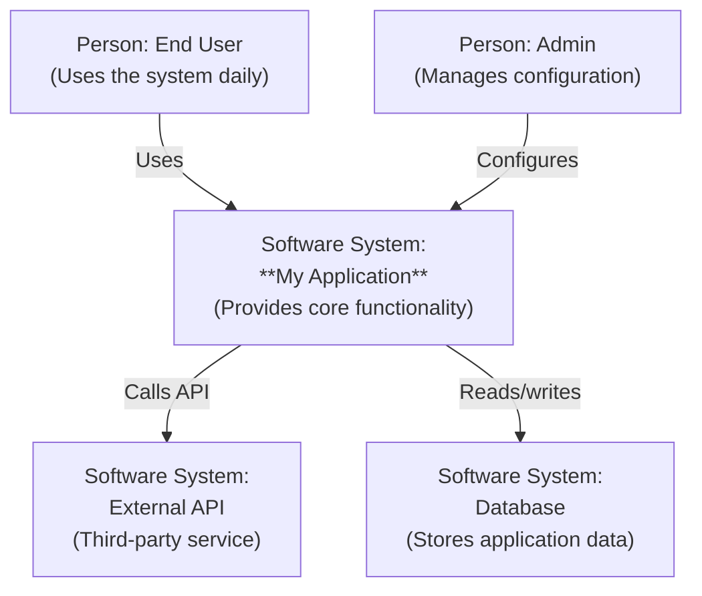

---

## Diagram Best Practices

1. **Keep diagrams focused** -- One concept per diagram. Split complex views into multiple diagrams rather than cramming everything into one.
2. **Label all edges** -- Every arrow should describe what flows along it (data, events, commands).
3. **Use consistent naming** -- Building block names in diagrams must match names in tables and text.
4. **Prefer flowchart for static views** -- Use `flowchart` for context, building blocks, and deployment. Use `sequenceDiagram` for runtime views.
5. **Use subgraphs for boundaries** -- System boundaries, network zones, and deployment environments are natural subgraph candidates.
6. **Limit nesting** -- Maximum 2 levels of subgraph nesting for readability.
7. **No styling** -- Do not add colors, fills, or custom CSS. Let the rendering theme handle appearance.
