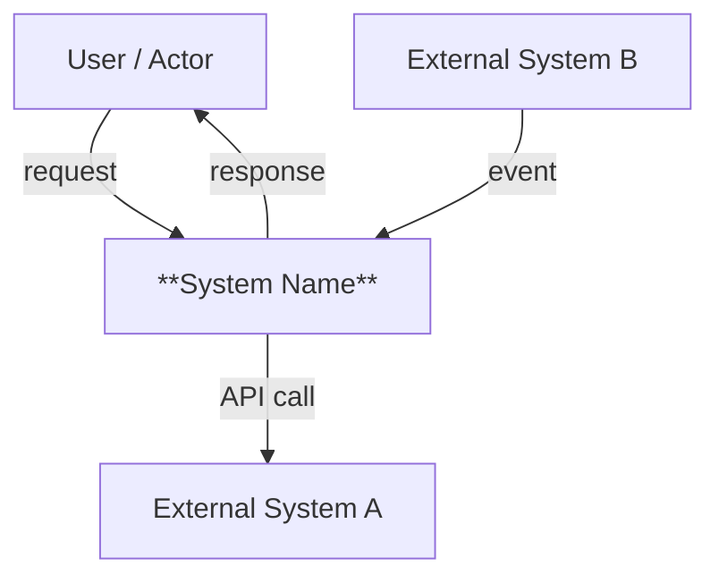
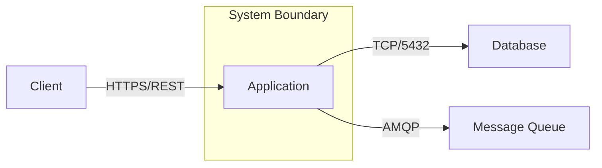
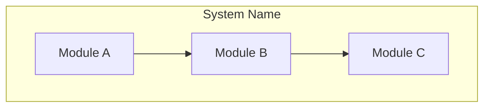
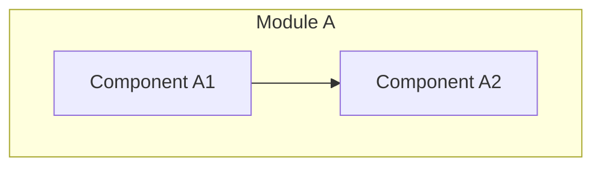
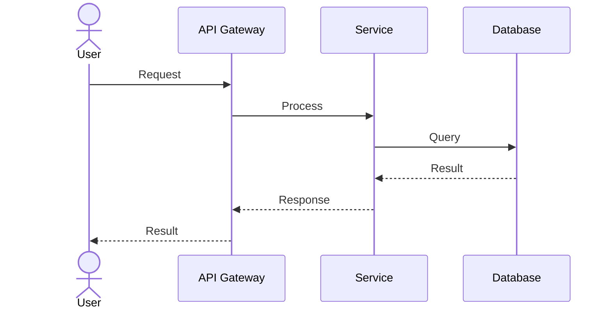
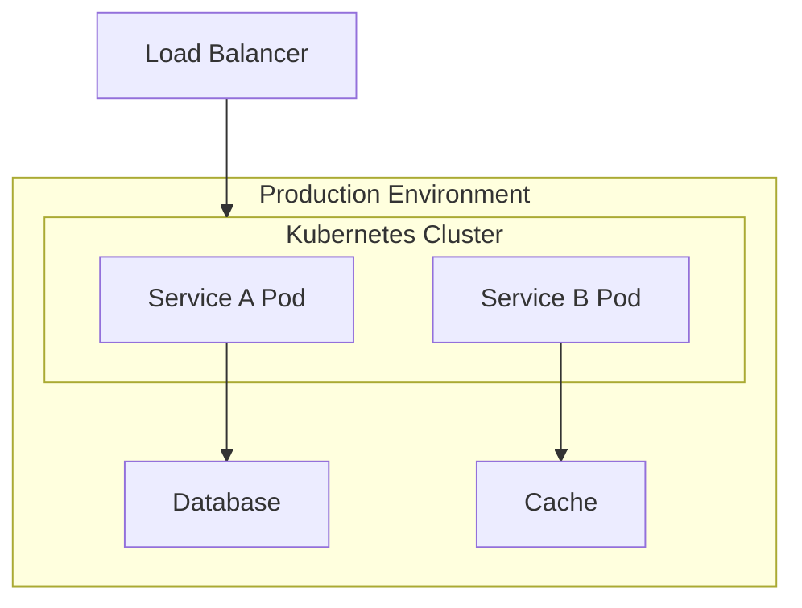
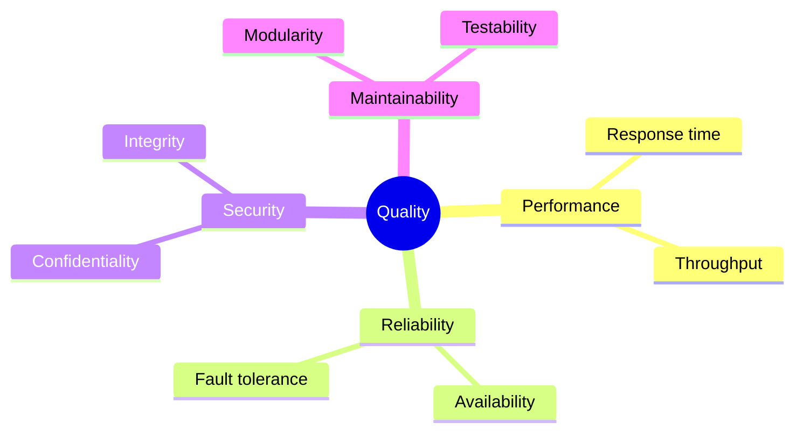

# Arc42 Section Templates

Complete markdown templates for all 12 arc42 sections based on the official arc42 template (Revision 7.0 EN). Each template includes proper heading hierarchy, guidance comments, placeholder tables, and Mermaid diagram blocks.

## Content Markers

Use these HTML comment markers to distinguish generated from manual content:

```html
<!-- arc42-generated -->
[Auto-generated content that can be replaced on update]
<!-- /arc42-generated -->

<!-- arc42-manual: Describe what the user should add here -->
[Human-written content that must be preserved on update]
<!-- /arc42-manual -->
```

---

## Section 1: Introduction and Goals

```markdown
# 1. Introduction and Goals

<!-- arc42: Describes the relevant requirements and the driving forces that
software architects and development team must consider. -->

## 1.1 Requirements Overview

<!-- arc42-generated -->
<!-- arc42: Short description of the functional requirements, driving forces,
extract (or abstract) of requirements. Link to (hopefully existing) requirements
documents (with version number and information where to find it). -->

| Priority | Requirement | Description |
|----------|-------------|-------------|
| High | | |
| Medium | | |
| Low | | |
<!-- /arc42-generated -->

## 1.2 Quality Goals

<!-- arc42: The top three (max five) quality goals for the architecture whose
fulfillment is of highest importance to the major stakeholders. -->

<!-- arc42-generated -->
| # | Quality Goal | Motivation | Scenario |
|---|-------------|------------|----------|
| 1 | | | |
| 2 | | | |
| 3 | | | |
<!-- /arc42-generated -->

## 1.3 Stakeholders

<!-- arc42: Explicit overview of stakeholders of the system, i.e. all persons,
roles or organizations that should know the architecture. -->

<!-- arc42-generated -->
| Role | Contact | Expectations |
|------|---------|-------------|
| | | |
<!-- /arc42-generated -->

<!-- arc42-manual: Add stakeholders not discoverable from the codebase -->
<!-- /arc42-manual -->
```

---

## Section 2: Architecture Constraints

```markdown
# 2. Architecture Constraints

<!-- arc42: Any requirement that constrains software architects in their freedom
of design and implementation decisions or decision about the development process. -->

## Technical Constraints

<!-- arc42-generated -->
| Constraint | Description |
|-----------|-------------|
| | |
<!-- /arc42-generated -->

## Organizational Constraints

<!-- arc42-manual: Document organizational constraints such as schedule, budget, team structure, process model -->
| Constraint | Description |
|-----------|-------------|
| | |
<!-- /arc42-manual -->

## Development Conventions

<!-- arc42-generated -->
| Convention | Description |
|-----------|-------------|
| | |
<!-- /arc42-generated -->
```

---

## Section 3: Context and Scope

```markdown
# 3. Context and Scope

<!-- arc42: Delimits your system from all its communication partners (neighboring
systems and users). Specifies the external interfaces. -->

## 3.1 Business Context

<!-- arc42: Specification of all communication partners with explanations of
domain specific inputs and outputs or interfaces. -->

<!-- arc42-generated -->


| Communication Partner | Input | Output |
|----------------------|-------|--------|
| | | |
<!-- /arc42-generated -->

## 3.2 Technical Context

<!-- arc42: Technical interfaces (channels and transmission media) linking your
system to its environment. Mapping of domain specific I/O to channels. -->

<!-- arc42-generated -->


| Interface | Protocol | Format | Notes |
|-----------|----------|--------|-------|
| | | | |
<!-- /arc42-generated -->
```

---

## Section 4: Solution Strategy

```markdown
# 4. Solution Strategy

<!-- arc42: A short summary and explanation of the fundamental decisions and
solution strategies that shape the system's architecture. -->

## Technology Decisions

<!-- arc42-generated -->
| Decision Area | Choice | Rationale |
|--------------|--------|-----------|
| Language | | |
| Framework | | |
| Database | | |
| Messaging | | |
| Authentication | | |
<!-- /arc42-generated -->

## Quality Goal Strategies

<!-- arc42: How the fundamental architecture approaches address the top quality goals -->

<!-- arc42-generated -->
| Quality Goal | Approach |
|-------------|----------|
| | |
<!-- /arc42-generated -->

## Organizational Decisions

<!-- arc42-manual: Development process, delegation, third-party decisions -->
<!-- /arc42-manual -->
```

---

## Section 5: Building Block View

```markdown
# 5. Building Block View

<!-- arc42: Static decomposition of the system into building blocks (modules,
components, subsystems, classes, interfaces, packages, libraries, frameworks,
layers, partitions, tiers, functions, macros, operations, data structures, ...)
as well as their dependencies (relationships, associations, ...) -->

## 5.1 Whitebox Overall System (Level 1)

<!-- arc42-generated -->


**Motivation:** Overview decomposition of the system into its main building blocks.

### Contained Building Blocks

| Building Block | Responsibility | Interfaces | Code Location |
|---------------|---------------|------------|---------------|
| | | | |

<!-- /arc42-generated -->

## 5.2 Level 2

<!-- arc42: Decompose selected building blocks from Level 1. Only decompose
blocks that are important, risky, or particularly complex. -->

### Module A (White Box)

<!-- arc42-generated -->


| Component | Responsibility |
|-----------|---------------|
| | |
<!-- /arc42-generated -->

## 5.3 Level 3

<!-- arc42-manual: Further decompose Level 2 blocks where needed for complex or risky components -->
<!-- /arc42-manual -->
```

---

## Section 6: Runtime View

```markdown
# 6. Runtime View

<!-- arc42: Behavior of building blocks as scenarios, covering important use
cases or features, interactions at critical external interfaces, operation
and administration, error and exception scenarios. -->

## Scenario: [Scenario Name]

<!-- arc42: Select architecturally relevant scenarios -- not every endpoint.
Focus on: critical business flows, complex interactions, error paths,
performance-sensitive paths. -->

<!-- arc42-generated -->
**Overview:** Brief description of this scenario and why it is architecturally relevant.



**Steps:**

1. User sends request to API Gateway
2. API Gateway routes to Service
3. Service queries Database
4. Result returned through the chain

<!-- /arc42-generated -->

## Scenario: [Error Scenario Name]

<!-- arc42-manual: Document error handling and exception scenarios -->
<!-- /arc42-manual -->
```

---

## Section 7: Deployment View

```markdown
# 7. Deployment View

<!-- arc42: Technical infrastructure used to execute your system, with
infrastructure elements like geographical locations, environments,
computers, processors, channels and net topologies as well as other
infrastructure elements and the mapping of (software) building blocks
to that infrastructure elements. -->

## Infrastructure Level 1

<!-- arc42-generated -->


**Motivation:** Overview of the deployment topology.

### Building Block to Infrastructure Mapping

| Building Block | Infrastructure Element | Notes |
|---------------|----------------------|-------|
| | | |

### Environment Overview

| Environment | Purpose | URL | Notes |
|------------|---------|-----|-------|
| Development | | | |
| Staging | | | |
| Production | | | |
<!-- /arc42-generated -->

## Infrastructure Level 2

<!-- arc42-manual: Detail internal structure of selected infrastructure elements if needed -->
<!-- /arc42-manual -->
```

---

## Section 8: Crosscutting Concepts

```markdown
# 8. Crosscutting Concepts

<!-- arc42: Overall, principal regulations and solution ideas that are relevant
in multiple parts (= crosscutting) of the system. Concepts form the basis
for conceptual integrity (consistency, homogeneity) of the architecture. -->

## Domain Model

<!-- arc42-generated -->
<!-- arc42: Core domain entities and their relationships -->
<!-- /arc42-generated -->

## Security and Authentication

<!-- arc42-generated -->
<!-- arc42: Authentication mechanism, authorization model, credential management -->
<!-- /arc42-generated -->

## Architecture Patterns

<!-- arc42-generated -->
<!-- arc42: Layering, module structure, design patterns in use -->
<!-- /arc42-generated -->

## Development Concepts

<!-- arc42-generated -->
### Build and Deployment Pipeline

### Testing Strategy

### Coding Standards
<!-- /arc42-generated -->

## Operational Concepts

<!-- arc42-generated -->
### Configuration Management

### Logging and Monitoring

### Scaling Strategy
<!-- /arc42-generated -->

## User Experience

<!-- arc42-manual: UI patterns, accessibility, UX guidelines if applicable -->
<!-- /arc42-manual -->
```

---

## Section 9: Architecture Decisions

```markdown
# 9. Architecture Decisions

<!-- arc42: Important, expensive, large scale or risky architecture decisions
including rationals. With "architecture decisions" we mean those decisions
that affect the structure, non-functional characteristics, dependencies,
interfaces, or construction techniques. -->

## ADR Format

Each decision follows this structure:

### ADR-NNN: [Decision Title]

- **Date:** YYYY-MM-DD
- **Status:** Proposed | Accepted | Deprecated | Superseded by ADR-NNN
- **Context:** What is the issue that motivates this decision?
- **Decision:** What is the change being proposed or decided?
- **Consequences:** What becomes easier or harder because of this change?

---

<!-- arc42-generated -->
<!-- Existing ADRs imported from project -->
<!-- /arc42-generated -->

<!-- arc42-manual: Add architecture decisions not documented elsewhere -->
<!-- /arc42-manual -->
```

---

## Section 10: Quality Requirements

```markdown
# 10. Quality Requirements

<!-- arc42: This section contains all quality requirements as quality tree with
scenarios. The most important ones have already been described in section 1.2. -->

## 10.1 Quality Tree

<!-- arc42-generated -->

<!-- /arc42-generated -->

## 10.2 Quality Scenarios

<!-- arc42: Concretization of quality requirements using quality scenarios -->

<!-- arc42-generated -->
| # | Quality Attribute | Scenario | Stimulus | Response | Metric/Target |
|---|------------------|----------|----------|----------|---------------|
| 1 | | | | | |
| 2 | | | | | |
<!-- /arc42-generated -->

<!-- arc42-manual: Add quality scenarios based on stakeholder interviews -->
<!-- /arc42-manual -->
```

---

## Section 11: Risks and Technical Debt

```markdown
# 11. Risks and Technical Debt

<!-- arc42: A list of identified technical risks or technical debts, ordered by
priority. -->

## Risks

<!-- arc42-generated -->
| # | Risk | Priority | Impact | Probability | Mitigation |
|---|------|----------|--------|-------------|------------|
| 1 | | | | | |
<!-- /arc42-generated -->

## Technical Debt

<!-- arc42-generated -->
| # | Debt Item | Priority | Impact | Source | Remediation Plan |
|---|-----------|----------|--------|--------|-----------------|
| 1 | | | | TODO/FIXME | |
<!-- /arc42-generated -->

<!-- arc42-manual: Add known risks not detectable from code analysis -->
<!-- /arc42-manual -->
```

---

## Section 12: Glossary

```markdown
# 12. Glossary

<!-- arc42: The most important domain and technical terms that your stakeholders
use when discussing the system. -->

<!-- arc42-generated -->
| Term | Definition |
|------|-----------|
| | |
<!-- /arc42-generated -->

<!-- arc42-manual: Add domain terms requiring business context -->
<!-- /arc42-manual -->
```

---

## Index README Template

```markdown
# Architecture Documentation (arc42)

> Based on the [arc42 template](https://arc42.org) by Dr. Gernot Starke and Dr. Peter Hruschka. Profile: **Lean**

| # | Section | Status | Last Updated |
|---|---------|--------|--------------|
| 1 | [Introduction and Goals](01-introduction-and-goals.md) | Draft | YYYY-MM-DD |
| 2 | [Architecture Constraints](02-architecture-constraints.md) | Stub | YYYY-MM-DD |
| 3 | [Context and Scope](03-context-and-scope.md) | Draft | YYYY-MM-DD |
| 4 | [Solution Strategy](04-solution-strategy.md) | Stub | YYYY-MM-DD |
| 5 | [Building Block View](05-building-block-view.md) | Draft | YYYY-MM-DD |
| 6 | [Runtime View](06-runtime-view.md) | -- | Omitted (Essential) |
| 7 | [Deployment View](07-deployment-view.md) | -- | Omitted (Essential) |
| 8 | [Crosscutting Concepts](08-crosscutting-concepts.md) | Stub | YYYY-MM-DD |
| 9 | [Architecture Decisions](09-architecture-decisions.md) | Draft | YYYY-MM-DD |
| 10 | [Quality Requirements](10-quality-requirements.md) | -- | Omitted (Lean) |
| 11 | [Risks and Technical Debt](11-risks-and-technical-debt.md) | Stub | YYYY-MM-DD |
| 12 | [Glossary](12-glossary.md) | Draft | YYYY-MM-DD |

**Status key:** Empty | Stub | Draft | Adequate | Thorough | Exemplary

---

*Generated by arc42-doc-generator plugin*
```
