# Mermaid Diagram Templates

Diagram patterns for trainee-facing architecture maps. Each template comes in three forms — **blank**, **annotated** (with `%%` guidance), and **filled**.

Two rules apply to every diagram in this skill:

1. **Provided/read-only components go in their own subgraph**, styled differently from the trainee's own modules.
2. **Edges are labeled with the data that flows**, not with the function being called. `-->|"validated records"|` teaches; `-->|"calls process()"|` does not.

---

## Component Diagram (the main one)

Shows every module as a box and the data moving between them. This is section 3 of `ARCHITECTURE.md` and is mandatory.

### Blank Template

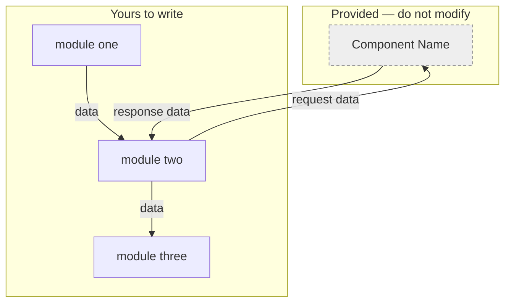

### Annotated Template

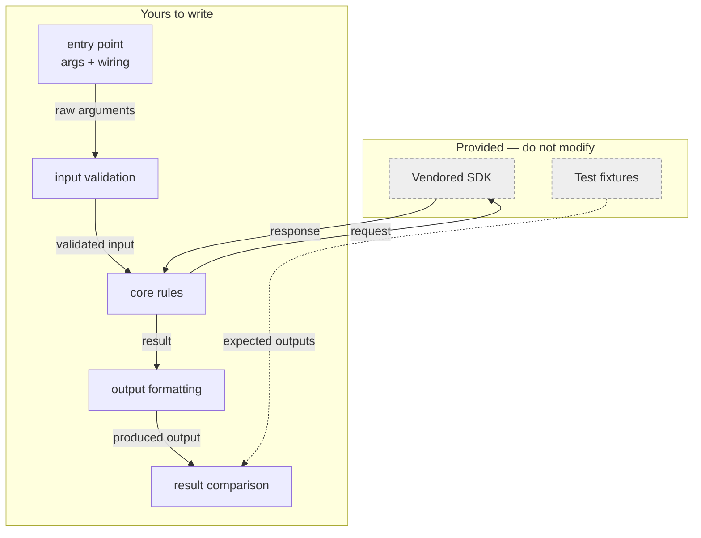

### Filled Example (a word-frequency CLI)

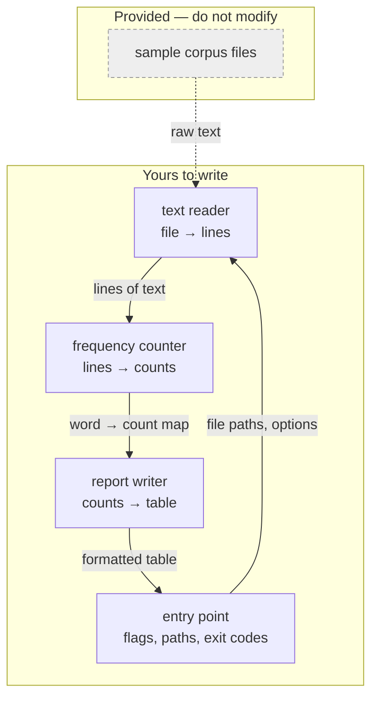

---

## Data Flow / Sequence Diagram (optional)

Include **only** when the order of operations is non-obvious — a loop with feedback, a retry, a multi-pass algorithm. For a straight pipeline it adds nothing; skip it.

### Blank Template

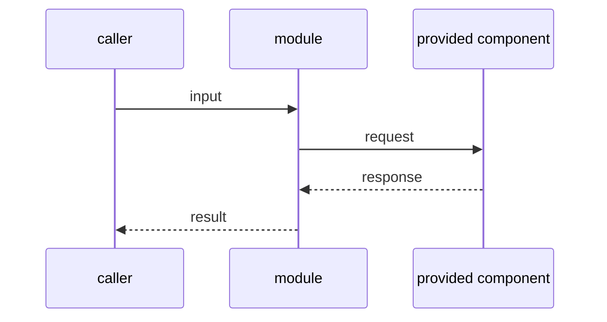

### Annotated Template

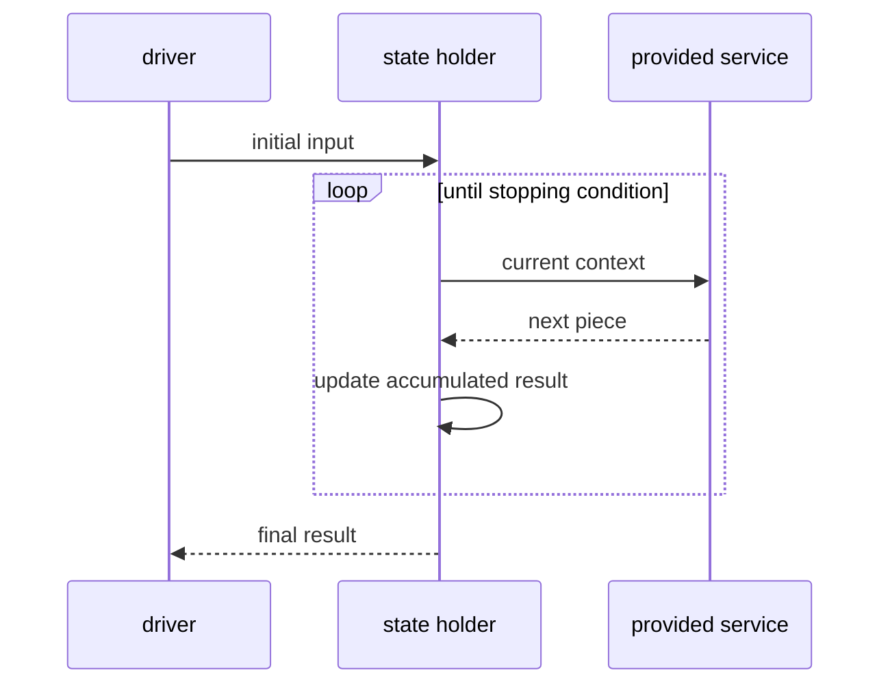

### Filled Example (retrying fetch with backoff)

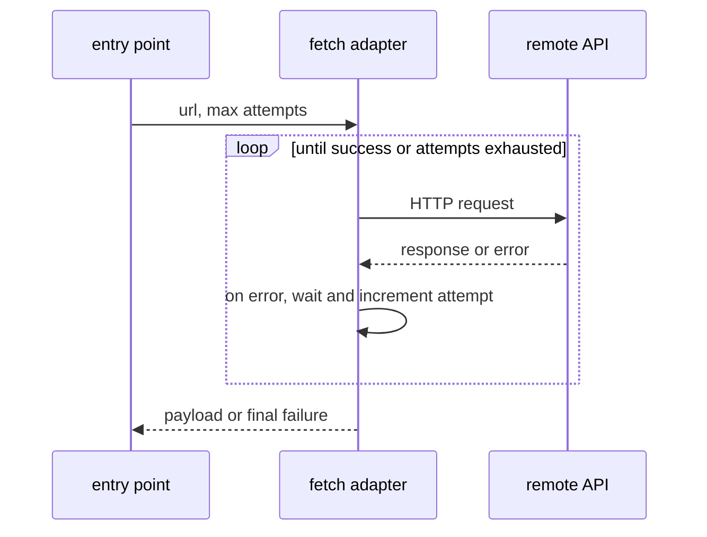

---

## Module Dependency Graph

Use when the trainee's worry is *coupling* — "can I test this alone?" — rather than data flow. Arrows mean "depends on", so a cycle is a defect you can see.

### Blank Template

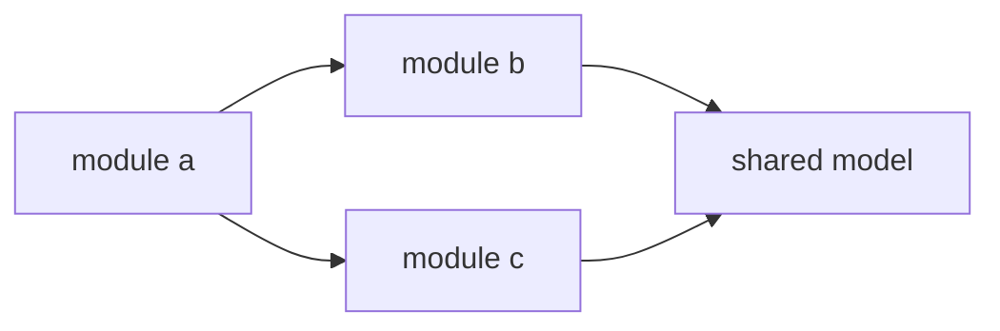

### Annotated Template

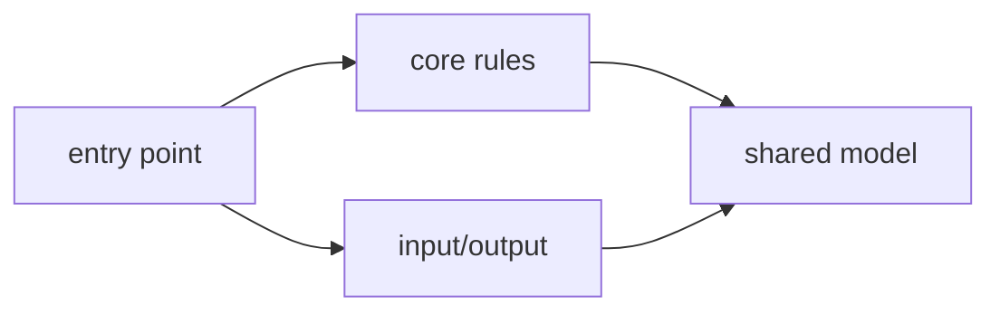

### Filled Example

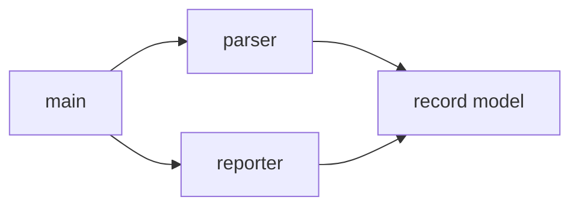

---

## Layer Diagram

Use when the task genuinely has layers — each layer may call downward only. Do not force it onto a pipeline.

### Blank Template

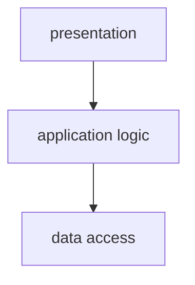

### Filled Example

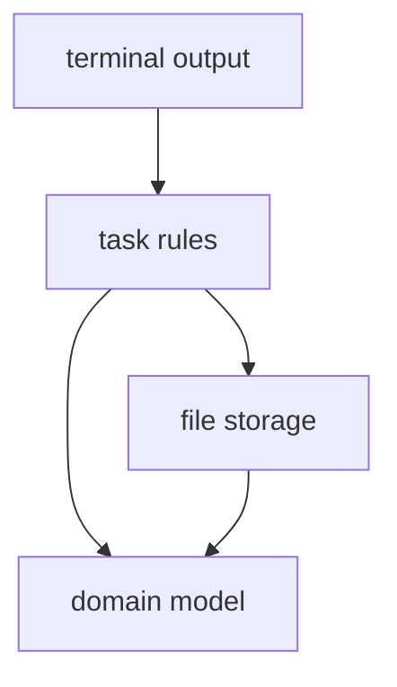

---

## Diagram Best Practices for trainees

- **One screen.** If it needs scrolling, the trainee cannot hold it. Cut boxes, not font size.
- **Respect the module cap in SKILL.md.** Below it you are probably not decomposing; above it you are decomposing by noun rather than by reason to change.
- **Name responsibilities, not files.** `frequency counter` teaches; `utils.py` does not.
- **Label edges with data.** If you cannot name what crosses the boundary, the boundary is in the wrong place.
- **No code in a node label.** No signatures, no types, no pseudocode. A node label that contains `def` has become a solution.
- **Distinguish given from authored.** Always. It is the difference between a constraint and a choice.
- **Dashed arrows for data that is read but not called** — fixtures, config, corpora.
- **Cycles are bugs — in the *dependency* graph.** If module A needs B to compile and B needs A, say so and ask which direction should be broken. A loop in a *data-flow* diagram is fine and often correct: a result traveling back to the entry point to be printed is not a dependency cycle.
- **` ` for a second line** in a node label to add a short qualifier. Keep it to a handful of words.
- **Quote every label containing punctuation.** `A["input (raw)"]` renders; `A[input (raw)]` does not.
